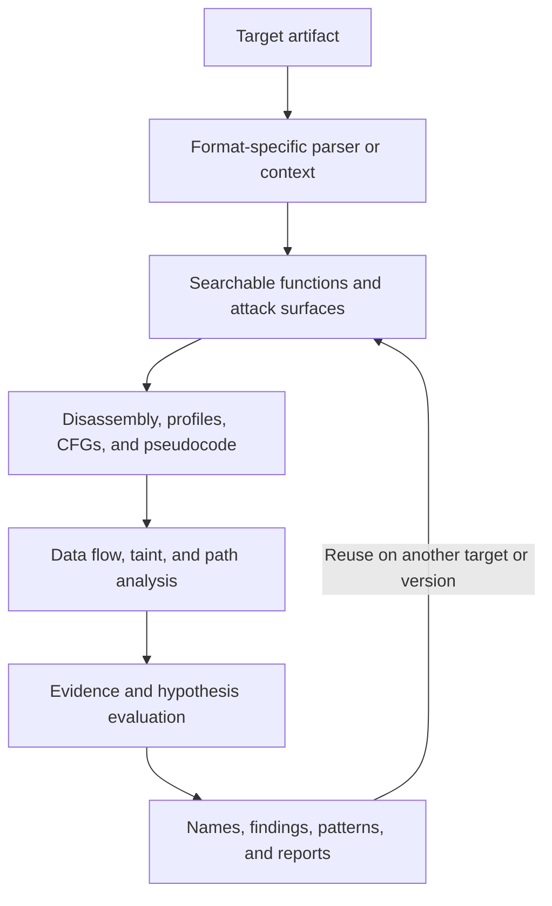

# Ablation

**A reverse-engineering framework for understanding binaries, firmware, and source code.**

Ablation helps you recover what a program does, find functions by behavior, trace how inputs reach sensitive operations, compare software versions, and preserve the evidence from an investigation. It works with stripped binaries and combines disassembly, program analysis, pseudocode lifting, semantic search, specialized scanners, and reusable research databases.

Use it from the command line, build analysis pipelines with its Python APIs, or give an LLM with terminal access the tools to conduct an investigation. Core analysis runs locally. The optional built-in LLM analyst adds an Anthropic-backed tool-calling loop.

Ablation covers native code, Android applications, HarmonyOS bytecode, Erlang modules, Go executables, firmware containers, source repositories, and selected host and network inspection tasks. Each analyzer has its own target formats, architecture assumptions, and dependencies; the support tables below explain those boundaries.


## Capabilities

**Semantic Search via BERT:** Searches code by concept instead of exact words. By mapping the actual meaning of the text, it cuts through the heaviest bottleneck of reverse engineering to help you pinpoint vulnerabilities faster.

**Extreme Performance:** Loads massive binaries in seconds rather than hours. By only analyzing the code you are actively looking at, it skips the heavy upfront processing of traditional tools so you can start reverse engineering immediately.

**Version Diffing:** Analyzes the actual behavior of updated software to verify vendor patches. It cuts through superficial repackaging to confirm if a vulnerability was genuinely fixed or just hidden.

**FORGE:** Ablation lets users build their own modules and add-ons. FORGE automatically audits that code before it gets stored, so every local module meets the same standard as the ones that ship with Ablation.

**Windows Kernel Driver & BYOVD Analysis:** Scans kernel drivers for risky entry points to stop attackers from using vulnerable, signed drivers to bypass your security software.

**Android / APK Analysis:** Maps out Android app attack surfaces without needing to decompile the code. It automatically scans and ranks internal libraries by security risk, allowing you to immediately target the most vulnerable components.

**Erlang / BEAM Analysis:** Safely scans Erlang bytecode to instantly highlight dangerous functions and hidden attack surfaces without running the application.

**Inter-Binary Taint Analysis:** Tracks the propagation of untrusted, user-controlled data across distinct, compiled executable files or binaries within a system (such as multi-binary firmware or cooperating processes) to detect vulnerabilities where data reaches sinks.

**DAG Adapter Language:** Maps raw machine code bytes through a structured bitfield layer to semantic operations, using the RGB/hex packing formula as the bridge between them.

**Cryptographic Analysis**

Ablation strips away every layer that makes cryptography invisible in a compiled binary. Entropy Mapper locates the encrypted region. Crypto Audit and HashAlgoDiscriminator identify the algorithm. XorSolver, BmpKeyExtractor, and CustomCBCDetector break the encryption or recover the key. ELFVtableReconstructor and VtableDispatchScanner reconstruct what the runtime does with the result.

A binary can hide its crypto from import-table analysis, from symbol tables, and from string search. These eight tools collectively close that gap, so by the end you know the algorithm, the key, and the ciphertext.


---

## Contents

- [How Ablation works](#how-ablation-works)
- [Installation](#installation)
- [Quick start](#quick-start)
- [Choose an entry point](#choose-an-entry-point)
- [Architecture and decompiler support](#architecture-and-decompiler-support)
- [Capability reference](#capability-reference)
- [Command-line reference](#command-line-reference)
- [Using Ablation with an LLM](#using-ablation-with-an-llm)
- [Interpreting results](#interpreting-results)
- [Repository map and documentation](#repository-map-and-documentation)
- [Published research](#published-research)
- [License and contact](#license-and-contact)
- [Acknowledgments](#acknowledgments)

## How Ablation works

An investigation moves from a target artifact to a searchable representation, then to increasingly specific evidence:

1. **Load the target.** Select the parser for its format. For ELF binaries, `BinaryContext` caches recovered functions, imports, exports, strings, calls, and cross-references.
2. **Find relevant code.** Search function descriptions, replay known patterns, inspect callers of interesting APIs, or run a scanner for a specific attack surface.
3. **Understand behavior.** Inspect annotated disassembly, function profiles, control-flow graphs, and supported pseudocode representations.
4. **Trace the cause.** Follow arguments, memory values, validation logic, and calls. Use architecture-specific taint tracking and bounded path analysis where supported.
5. **Evaluate the explanation.** Collect evidence for competing hypotheses, compare versions, or probe supported leaf functions under emulation.
6. **Preserve the result.** Save recovered names, findings, patterns, and hypothesis sessions. Export results for review and reuse the knowledge on later targets.



The components can also be used independently. For example, inspect an APK manifest without building embeddings, decode SPU instructions without a taint engine, or audit a source repository without loading a binary.

## Installation

Requires **Python 3.10 or newer**. The examples below use a POSIX shell.

```bash
git clone https://github.com/Ablation-Tool/ablation.git
cd ablation
python3 -m venv .venv
source .venv/bin/activate
python -m pip install -e .
ablation --help
```

The base installation includes Capstone, LIEF, NumPy, pyelftools, and sentence-transformers. Semantic search loads its embedding model on demand; the first use may download model weights. Subsequent use can reuse cached weights and embeddings.

Install additional dependencies for the capabilities you need:

| Capability | Installation or requirement |
|---|---|
| Built-in LLM analyst and FORGE module audits | `python -m pip install -e ".[llm]"`; Anthropic credentials and an available model |
| LLM integration plus angr-backed analysis | `python -m pip install -e ".[full]"` |
| Unicorn leaf-function probes | `python -m pip install unicorn` |
| Z3 path solver | `python -m pip install z3-solver` |
| STUMPY matrix-profile backend | `python -m pip install stumpy`; a NumPy fallback is available |
| Vendor YAML profiles | `python -m pip install PyYAML` |
| Binary Ninja integration | Ablation installed in Binary Ninja's Python environment |
| Optional host/network modules | Module-specific dependencies, external tools, and target access |

The `full` extra installs the dependencies declared in `pyproject.toml`; specialized tools can require additional packages.

## Quick start

### Inspect and search an ELF binary

These examples use an **x86-64 ELF** target. Replace `./target.elf` and the example address with values from your investigation.

```bash
ablation analyze ./target.elf

# Use a database dedicated to this target or investigation.
ablation search ./target.elf \
  "network-controlled length passed to a memory copy without a bounds check" \
  --db ./target-functions.db --top-k 10

# Inspect an address returned by the search.
ablation profile ./target.elf 0x12340
ablation window ./target.elf 0x12340 --calls
ablation cfg ./target.elf 0x12340 --insns

# Follow modeled data flow through the x86-64 analysis path.
ablation taint ./target.elf --flow-sensitive

# Replay registered patterns and export candidate results.
ablation sweep ./target.elf --db ./target-functions.db \
  --json ./results.json --sarif ./results.sarif
```

The semantic search API searches the loaded database's corpus. A dedicated database keeps unrelated targets out of a single-target search.

### Compose the same building blocks in Python

```python
from pathlib import Path

from ablation.analyzers.binary_context import BinaryContext
from ablation.analyzers.corpus_builder import CorpusBuilder
from ablation.analyzers.semantic_search import SemanticSearcher

binary = str(Path("./target.elf").resolve())  # x86-64 ELF example
db_path = str(Path("./target-functions.db").resolve())

ctx = BinaryContext.load_or_build(binary)
print(ctx.summary())

CorpusBuilder(db_path=db_path).build(
    binary,
    product="my-target",
    version="1.0",
    arch="x86-64",
)

searcher = SemanticSearcher(db_path)
searcher.build_corpus()
matches = searcher.query(
    "parser copies a variable-length field into a fixed-size buffer",
    top_k=10,
)

for match in matches:
    print(f"0x{match.va:x} {match.name} score={match.score:.3f}")
    print("Calls:", ctx.callees_of(match.va))
    print("Strings:", ctx.strings_in_func(match.va))
```

For native pseudocode, specify the architecture explicitly:

```python
from ablation.analyzers.binary_lifter import BinaryLifter

lifter = BinaryLifter.from_path("./target.elf", arch="x86_64")
print(lifter.lift_function(0x12340))
```

These outputs provide evidence for review. Search scores measure similarity; they are not probabilities that a vulnerability exists.

## Choose an entry point

| Input or question | Start here | What you get |
|---|---|---|
| ELF executable, library, or supported kernel object | `BinaryContext`, ELF parsers, architecture-specific analyzers | Functions, imports, strings, cross-references, and analysis context |
| Windows PE executable or DLL | PE parsers; `sweeps/pe_sweep.py` for i386 PE32 | Headers, sections, imports, exports, and PE32 semantic triage |
| Windows `.sys` driver | `KernelDriverAnalyzer`, `BYOVDDetector`, IOCTL tools | Driver metadata, dispatch surfaces, and dangerous capability indicators |
| Mach-O executable | `macho_analyzer.py`, `binary_parser.py`, relevant Go tools | Load commands, segments, dylibs, code-signing metadata, and specialized inspection |
| Android APK or DEX | `APKParser`, DEX tools, JNI/Binder scanners | Manifest, bytecode, native-library relationships, and exposed components |
| HarmonyOS ArkTS `.abc` | `ABCParser`, `ARKDisasm`, `ABCDecompiler` | Parsed methods, decoded bytecode, and JavaScript-like pseudocode |
| Erlang/Elixir `.beam` | `BeamContext` | Exports, imports, atoms, literals, and available debug information |
| Java `.class` or `.jar` | `modules/java_re.py`, `modules/java_decompiler.py` | Class structure, constants, members, and security-relevant bytecode patterns |
| Firmware image | Firmware scanners and format-specific extractors | Container metadata, partitions, embedded filesystems, and extracted components |
| Source repository | `SourceContext`, source scanners, `FORGE.audit_source()` | Routes, trust boundaries, dangerous sinks, and audit candidates |
| Memory dump, BMP, or video container | Dedicated memory/forensics modules | Reconstructed ELF content, hidden data, or container anomalies |
| Live host, API, or network service | Optional `modules/` tools | Environment-specific enumeration, tracing, or active inspection |

`BinaryContext` is an **ELF analysis context**. Use the format-specific entry points for PE, Mach-O, APK, BEAM, and other inputs. File-format parsing and downstream program-analysis coverage are separate capabilities.

## Architecture and decompiler support

An **ISA** is an instruction set; an **ABI** defines calling conventions and related binary interfaces. A **CFG** is a control-flow graph. Ablation separates instruction decoding, instruction/ABI models, CFG construction, taint analysis, and pseudocode lifting.

| Architecture | Instruction/ABI, CFG, and data-flow modules | Taint tracking | Native pseudocode |
|---|---|---|---|
| ARM32 / Thumb-2 | `isa_arm32`, `insn_arm32`, `cfg_arm32`, `analysis_arm32` | Binary and labeled instruction-stream trackers | — |
| ARM64 / AArch64 | Corresponding `*_arm64` modules | Instruction-stream and binary analysis | Implemented |
| x86 / x86-64 | `isa_x86`, `insn_x86`, `cfg_x86`, `analysis_x86` | Labeled x86 modes; binary workflows centered on x86-64 ELF | x86-64 implemented |
| MIPS32 / MIPS64 | Corresponding `*_mips` modules | MIPS32, MIPS64, and labeled trackers | — |
| nanoMIPS | Specialized variable-length decoder; no dedicated `cfg_nanomips`/`analysis_nanomips` family | Dedicated tracker | — |
| PowerPC32 / PowerPC64 | Corresponding `*_ppc` modules | PPC32, PPC64, and labeled trackers | — |
| RISC-V 32 / 64 | Corresponding `*_riscv` modules | RV32, RV64, and shared instruction-stream tracking | — |
| LoongArch64 | Corresponding `*_loongarch64` modules and custom decoders | Dedicated tracking and kernel-oriented helpers | Stub |
| Synopsys ARC EM/HS | Corresponding `*_arc` modules; decoded-listing analysis and frame decoder | Dedicated and labeled trackers | — |
| Renesas V850/RH850 | Corresponding `*_v850` modules and frame decoder | Dedicated tracker | — |
| HiSilicon RV32 extensions | Custom decoder used with supported RV32 analysis | Through RV32 integration | — |
| Cell BE SPU | Dedicated disassembler and embedded ELF inspection | — | — |

“Implemented” means a pseudocode path exists, not complete instruction coverage or reconstruction of original source. ARM64 lifting uses CFG traversal; x86-64 lifting uses linear disassembly with register tracking. LoongArch64 native lifting remains unimplemented.

Bytecode lifting is separate: DEX produces pseudo-Java IR, and ArkTS produces JavaScript-like pseudocode. BEAM and Java class inspection do not imply equivalent native decompiler support.

Architecture modules may accept decoded instruction streams even where direct binary loading is more limited. The PE32 sweep performs semantic analysis and skips taint tracking. ARC, V850, and nanoMIPS frame decoding also has a narrower scope than complete instruction semantics.

## Capability reference

Unless a path is shown, analyzer filenames below are in [`ablation/analyzers/`](ablation/analyzers/). Specialized scanners describe their target assumptions in their source and [module reference](docs/module-reference/).

### Binary parsing, discovery, and annotation

| Component | Purpose |
|---|---|
| `core/elf_parser.py`, `pe_parser.py`, `pe_analyzer.py`, `macho_analyzer.py`, `binary_parser.py` | Parse native binary metadata, segments/sections, symbols, imports, and exports as applicable to each format |
| `core/disasm_engine.py` | Capstone-based disassembly and function/CFG inspection |
| `arc_decoder.py`, `v850_decoder.py`, `nanomips_decoder.py`, `loongarch_decoder.py` | Architecture-specific instruction framing and supported opcode/control-transfer decoding |
| `core/platform_detect.py` | Inspect the host OS, architecture, kernel, libc, and available capabilities |
| `binary_context.py` | Cache ELF analysis context by binary hash; expose callers, callees, strings, function boundaries, and name overlays |
| `xref_graph.py` | Build ELF call and string-reference graphs for supported x86-64, ARM64, and ARM32 targets |
| `static_elf32_func_start_scanner.py`, `i386_absolute_xref_scanner.py` | Recover candidate function starts and absolute-address string references in stripped i386 code |
| `window_analyzer.py`, `func_profiler.py` | Produce annotated disassembly windows and compact function reports with calls, arguments, strings, and sink information |
| `reg_annotator.py`, `arm32_reg_annotator.py`, `ipreg_annotator.py` | Track register values and argument provenance, including supported cross-function propagation |
| `library_inventory.py` | Batch-triage native ELF libraries, including JNI and security metadata |

### Semantic search, signatures, and version comparison

Semantic search represents functions using recovered names, inferred roles, call targets, strings, and notes, then compares those descriptions with a natural-language query. Separate helpers normalize assembly and encode opcode behavior for structural comparison.

The current `SemanticSearcher` model constant is **`sentence-transformers/all-mpnet-base-v2`**. Some older comments and documents refer to MiniLM; consult the implementation when selecting or reproducing a model-dependent workflow.

| Component | Purpose |
|---|---|
| `corpus_builder.py`, `func_id_db.py` | Build and store function records associated with binary identities and versions |
| `semantic_search.py` | Rank functions by semantic similarity to a query or another function |
| `pattern_library.py` | Store useful search patterns and replay them against new corpora |
| `sig_library.py` | Suggest recognizable function identities and apply provisional `likely:` names |
| `engine_pattern_library.py` | Label engine-code candidates for Unreal Engine, Unity IL2CPP, Source 2, id Tech, and CryEngine |
| `structural_sim.py` | Compare opcode categories, constants, imported calls, branch density, and function size |
| `opseq.py`, `dtw_matcher.py` | Encode opcode-category sequences and compare them using dynamic time warping |
| `sax_index.py` | Build a compact symbolic index of opcode sequences to shortlist similar functions |
| `subsequence_searcher.py` | Find smaller behavioral patterns within function instruction sequences |
| `matrix_profile_diff.py` | Identify locally changed regions between function versions using matrix profiles |
| `version_delta.py` | Track candidate function homologs and changes across builds |
| `version_delta_finetune.py` | Generate structural training pairs, fine-tune a similarity model, and evaluate separation |
| `lib_graph.py` | Resolve library import/export relationships across an ELF collection |

A version match identifies code worth comparing. Determining whether a patch removes a vulnerability requires examining the changed logic and its callers.

### Control flow, data flow, and indirect calls

Taint analysis tracks modeled input influence through instructions and calls toward configured sensitive operations. Its precision depends on the instruction model, ABI, recovered CFG, memory abstraction, and source/sink definitions.

| Component | Purpose and scope |
|---|---|
| `cfg_builder.py` | Recover per-function CFGs from x86-64 ELF code |
| `isa_*`, `insn_*`, `cfg_*`, `analysis_*` | Architecture/ABI models, normalized instructions, CFGs, and flow-sensitive analysis over decoded instructions |
| `taint_tracker*.py` | Architecture-specific binary and instruction-stream taint engines; APIs and supported modes differ |
| `mips_analyzer.py` | MIPS32 ELF taint, function profiling, and static-analysis helpers |
| `dataflow_engine.py` | Shared worklist/fixed-point analysis, constant propagation, reaching definitions, dominators, loops, and sparse conditional constant propagation |
| `path_solver.py` | Bounded x86-64 symbolic path exploration with Z3 constraints |
| `cross_binary_taint.py` | Extend supported ELF taint workflows across resolved shared-library imports and exports |
| `bss_taint_tracker.py` | Recognize modeled flows through BSS/global pointer pairs, including firmware decrypt-loop candidates |
| `callsite_tracer.py`, `sse_slicer.py` | ARM64 call-argument tracing and structured symbolic expression slicing |
| `arm64_global_tracker.py`, `interproc_field_writer.py` | Trace named globals and locate writes to structure fields across supported ARM64 call chains |
| `arm64_fgets_fd_discriminator.py` | Distinguish file-backed and network-backed `fgets` sources where provenance can be recovered |
| `arm_symbolic.py`, `arm_disasm.py` | Lightweight ARM32 symbolic analysis and a custom ARM instruction decoder |
| `libfunc_db.py` | Classify stripped ARM64 PLT functions from call-site behavior and library-function summaries |
| `vtable_resolver.py` | Recover candidate ARM64 vtables and indirect-call targets |
| `elf_vtable_reconstructor.py`, `vtable_dispatch_scanner.py` | Reconstruct x86-64 ELF vtables and identify virtual-dispatch sites |
| `proto_fsm.py` | Extract protocol-state information from supported ARM64 MMTLS handshake patterns |

Here, **SSE means structured symbolic expressions**. Cross-binary analysis follows resolved call relationships; it does not automatically infer arbitrary IPC, socket, or file-based communication between processes.

### Vulnerability and attack-surface scanners

| Component | What it looks for |
|---|---|
| `format_string_scanner.py` | Nonliteral format-argument provenance at supported x86-64 ELF printf-family calls |
| `heap_vuln_scanner.py`, `heap_uaf_scanner.py` | Selected allocation arithmetic, use-after-free, double-free, overflow, and related heap patterns in x86-64 code |
| `intoverflow_scanner_arm32.py` | ARM32 input-influenced arithmetic reaching allocation sizes without a recognized bounds check |
| `la64_heap_vuln_scanner.py` | Overflow-prone LoongArch64 arithmetic reaching allocation sinks |
| `loongarch64_max_not_min_scanner.py` | A specific LoongArch64 min/max code-generation pattern and downstream memory-sink use |
| `length_underflow.py` | x86-64 protocol-length subtraction and underflow patterns |
| `chunk_walker_validator.py` | Candidate TLV/chunk-walking code missing expected alignment handling |
| `sql_sink_scanner.py` | SQL construction and execution patterns involving supported C/C++ ELF database APIs |
| `sink_arg_classifier.py` | Provenance of command arguments at x86-64 execution sinks |
| `sanitizer_detector.py` | Character-allowlist validators and whether their inferred accepted characters include shell metacharacters |
| `fork_exec_classifier.py` | x86-64 fork callers classified as worker creation, execution after fork, or child-exit patterns |

The sanitizer detector analyzes **input-validation routines**. Compiler instrumentation recognition for LoongArch64 is provided separately by `loongarch_decoder_v2.py`.

### Firmware and embedded systems

| Component | Purpose |
|---|---|
| `core/firmware_analyzer.py` | Firmware signature scanning, candidate credentials, entropy classification, and component-version clues |
| `firmware_container.py` | Parse the supported plaintext-header/fixed-record partition-container layout and identify partition payloads |
| `fortios_firmware_extractor.py` | Supported FortiOS hardware-firmware extraction, XOR recovery, and partition discovery |
| `preauth_route_auditor.py`, `flatui_method_decoder.py` | Inspect Flatui-style firmware HTTP routes and recover candidate method mappings |
| `cmdb_surface_mapper.py` | Map FortiWeb/FortiOS x86-64 CMDB table access and functions that also call execution sinks |
| `vendor_profile.py`, `ablation/profiles/fortinet.yaml` | Register vendor sinks, validators, and known execution patterns |
| `hardware_root_finder.py` | Find functions accessing known memory-mapped I/O ranges, such as UART, GPIO, DMA, and device peripherals |
| `physmem_elf_vfs.py` | Reconstruct ELF content from supported QEMU physical-memory core dumps |
| `ppc32_func_discovery.py`, `ppc32_got2_resolver.py`, `ppc32_plt_tracer.py` | Recover PowerPC32 functions and resolve supported GOT2/PLT call patterns |
| `ppc64_dynds_classifier.py`, `ppc64_vmx_density.py` | Classify PowerPC64 data-structure patterns and vector-heavy functions |
| `hisi_rv32_ext.py` | Decode HiSilicon custom RV32 instructions, including variable-length extensions |
| `dwarf_loongarch64.py`, `syscall_loongarch64.py`, `loongarch_decoder_v2.py` | LoongArch64 debug/unwind metadata, syscall analysis, and KASAN/KCOV instrumentation tagging |
| `spu_disassembler.py` | Decode Cell BE SPU instructions and inspect embedded SPU objects |

CMDB access and an execution sink in the same function establish a candidate relationship. Follow the actual data flow to determine whether configuration data reaches that sink. MMIO “hardware roots” identify device-facing code; they do not establish a cryptographic root of trust.

### Android, HarmonyOS, Erlang, Java, and Go

| Target | Components and behavior |
|---|---|
| Android containers | `core/apk_parser.py` parses APK, binary Android XML, and DEX structures using the Python standard library |
| Android security triage | `dex_analyzer.py` inspects manifest exposure, strings, dangerous APIs, and related patterns; `library_inventory.py` inventories native libraries |
| Android bytecode | `dex_disasm.py` decodes DEX instruction formats; `dex_lifter.py` emits pseudo-Java IR |
| Java/native boundary | `jni_bridge_scanner.py` correlates DEX native declarations, library-loading references, and native ELF exports |
| Android IPC | `binder_scanner.py` identifies Binder services, AIDL stubs, and transaction-handler surfaces |
| HarmonyOS/ArkTS | `abc_parser.py`, `abc_disasm.py`, and `abc_decompiler.py` parse supported ABC versions, decode Ark instructions, and emit pseudocode |
| Erlang/Elixir | `beam_context.py` extracts BEAM imports, exports, atoms, literals, strings, available debug data, and obfuscation indicators |
| Java class/JAR files | `modules/java_re.py` and `modules/java_decompiler.py` inspect class structures and selected security patterns |
| Go metadata | `go_pclntab.py`, `go_string_resolver.py`, and `go_binary_re.py` recover supported runtime tables, names, strings, and binary context |
| Go call surfaces | `go_dangerous_callers.py` and `go_subprocess_scanner.py` identify sensitive call sites and classify subprocess command paths |
| Obfuscated Go | `go_garble_re.py` provides Garble-oriented ELF analysis helpers |

Go tooling is sensitive to runtime version, architecture, and obfuscation. Flatui HTTP method decoding belongs to the firmware route-analysis workflow; it is separate from Android DEX method decoding.

### Windows drivers

`kernel_driver_analyzer.py` inspects Windows driver metadata, imports, callbacks, IOCTL-related patterns, and other security-relevant structures. `ioctl_attack_surface.py` maps candidate control codes and handler/buffer-access patterns. `byovd_detector.py` assesses dangerous driver capabilities associated with bring-your-own-vulnerable-driver techniques.

An imported API or dangerous capability is a triage signal. Confirm dispatch reachability, access controls, and attacker influence before treating it as an exploitable driver vulnerability.

### Hypotheses and controlled execution

The hypothesis subsystem, also described as **Active Architecture Tomography**, records competing explanations about a binary and the evidence supporting or contradicting them.

| Component | Purpose |
|---|---|
| `hypothesis_models.py` | Hypotheses, evidence records, probes, and serializable sessions |
| `hypothesis_engine.py` | Seed claims, attach evidence, plan or execute supported probes, and save the investigation |
| `evidence_scorer.py` | Aggregate support and contradiction across evidence families |
| `probe_ranker.py` | Rank useful next probes using expected discrimination, observability, and cost |
| `probe_adapters.py` | Adapters for disassembly, CFG, cross-references, lifting, semantic search, version comparison, taint, and manual evidence |
| `dynamic_sandbox.py` | Separate Unicorn-backed ARM64/x86-64 ELF leaf-function probes with controlled inputs and captured register outputs |

Hypothesis states include `UNTESTED`, `PLAUSIBLE`, `SUPPORTED`, `CONFIRMED`, `UNRESOLVED`, and `REJECTED`. These are analysis states whose meaning depends on the attached evidence.

`HypothesisEngine.plan()` proposes work. `step(..., approved=True)` executes an available adapter when a context is attached; default stepping records a proposed probe. The dynamic sandbox has its own API, with leaf checks, PLT-entry aborts, instruction limits, and memory snapshot/restore. It does not provide full-system firmware emulation.

### Encoding DAG and semantic IR

`encoding_dag.py` provides a programmable connection between raw instruction bytes and semantic operations:

```text
Raw bytes / integer representation
                  ↕
Named bitfields and encoding templates
                  ↕
Semantic operations and data-flow edges
```

`Field`, `Template`, and `EncodingNode` describe bit layouts. `SemanticOp`, `SemanticBlock`, and `DataflowEdge` describe operations and dependencies. `Binding` and `ISASpec` connect the layers for encoding and decoding. `SemanticBlock.dag_nodes()` provides dependency ordering.

The bundled `ISA24` is a fixed-width toy ISA demonstrating round trips, including 24-bit RGB/hex packing. Supporting another instruction set requires defining its templates and semantic bindings.

### Cryptography, forensics, and detection artifacts

| Component | Purpose |
|---|---|
| `entropy_mapper.py` | Locate regions with different Shannon-entropy characteristics |
| `xor_solver.py` | Investigate repeating-XOR obfuscation using known plaintext and statistical approaches |
| `crypto_pattern_detector.py` | Recognize selected hash constants and custom CBC implementation patterns in supported ARM32/Thumb code |
| `crypto_audit.py` | Inspect selected key-material, token, TLS, and host cryptographic-posture indicators |
| `lsb_stego_extractor.py` | Extract BMP least-significant-bit data and supported secret-sharing key material |
| `video_container.py` | Inspect MP4/MOV, MKV/WebM, and AVI structures for malformed regions and embedded or appended content |
| `core/bv41_decoder.py` | Decode Apple's BV41 chunked LZ4 container format |
| `core/tls_analyzer.py` | Inspect TLS endpoints, protocol/cipher behavior, and certificates |
| `core/swift_demangle.py` | Best-effort Swift symbol demangling, with an external-tool fallback |
| `core/shellcode_utils.py` | Shellcode templates, byte checks, encoding helpers, and related inspection utilities |
| `core/yara_generator.py`, `core/attck_tagger.py` | Generate YARA detection rules and enrich findings with keyword-based MITRE ATT&CK tags |

Entropy and recognizable constants help prioritize investigation. Key recovery and decryption depend on the supported scheme and available evidence.

### Source-code auditing

Source analysis uses `SourceContext` rather than `BinaryContext`. The ingestion layer indexes supported JavaScript/TypeScript, Python, Rust, Go, Java, Ruby, and PHP files; individual analyzers recognize selected language and framework patterns.

| Component | Purpose |
|---|---|
| `source_ingestion.py` | Index a local or cloned repository and locate candidate routes |
| `source_entry_classifier.py` | Classify recognized authentication wrappers and entry-point exposure |
| `source_sink_scanner.py` | Find code-evaluation, subprocess, SSRF, path-traversal, and related sink patterns |
| `source_taint_tracker.py` | Trace supported call relationships backward from sinks toward HTTP entry points |
| `source_isolation_checker.py` | Identify database-query patterns missing recognized tenant scope |
| `source_arch_risk.py` | Flag combinations such as unsafe rendering with extensible dispatch or shared components |
| `source_audit_compressor.py` | Build compact per-file security profiles to prioritize review |

Run the combined FORGE source-audit pipeline without an LLM:

```bash
python -m ablation.analyzers.forge source /path/to/repository
```

Use the individual modules for additional analyses such as source taint and tenant isolation; the combined pipeline does not run every source analyzer.

### Persistent knowledge

| Store | What it preserves |
|---|---|
| `BinaryContext` cache | Extracted ELF context under `~/.ablation/cache/`, keyed by target hash |
| `func_id_db.py` | SQLite binary/function identities, descriptions, names, and version information; default `~/.ablation/func_id.db` |
| `name_registry.py` | Recovered function-name overlays in `~/.ablation/function_names.json` |
| `finding_registry.py` | Cross-target findings and retrieval data in `~/.ablation/findings.db` |
| `pattern_library.py` | Reusable queries and recorded hits in `~/.ablation/patterns.json` |
| Hypothesis sessions | JSON records of claims, probes, and evidence |
| FORGE local store | Registered Python modules under `~/.ablation/local_modules/` |

Confirmed findings can become search seeds for later investigations. Saving a name, a candidate, or a high similarity score does not by itself validate the associated conclusion.

### Sweeps and reports

| Script | Workflow |
|---|---|
| `sweeps/base_sweep.py` | Generic semantic vulnerability-profile sweep |
| `sweeps/fortinet_sweep.py` | Fortinet-oriented import triage, semantic search, and supported taint/argument analysis |
| `sweeps/android_sweep.py` | APK manifest, DEX/API, and native-library security triage |
| `sweeps/pe_sweep.py` | i386 PE32 semantic sweep using IAT resolution and function-start heuristics |
| `sweeps/report_generator.py` | Markdown reports with ranked candidates and prior-finding correlations |

These are specialized workflows with different inputs and assumptions. The generic `ablation sweep` command runs registered semantic patterns; it does not automatically execute every specialized sweep script.

### Output, integrations, and FORGE

| Component | Capability |
|---|---|
| `ablation/export/sarif.py` | SARIF 2.1.0 export for sweep results and stored findings |
| `ablation/export/json_export.py` | Structured JSON export for results and findings |
| `ablation/integrations/binja_plugin.py` | Binary Ninja function naming, semantic search, sweeps, and findings integration |
| `ablation/analyzers/llm_analyst/` | Anthropic-backed agent loop, context construction, prior-record retrieval, and analysis tasks |
| `bare_adapter.py` | Optional adapter to an external BARE installation for ranking related Metasploit modules from finding descriptions |
| `forge.py` | Module auditing, registration, loading, and source auditing |

FORGE exposes four main operations:

- `FORGE.audit_module(path)` submits a Python module for an LLM-based readiness audit.
- `FORGE.audit_source(path)` runs the local source-audit pipeline.
- `FORGE.register(path)` audits and copies a module into the local store; normal registration blocks on reported HIGH/CRITICAL findings.
- `FORGE.load_local_modules()` imports registered local modules when called.

Module auditing and registration require the optional Anthropic integration. Source auditing does not. FORGE's audit report is a review aid, not a correctness guarantee.

### Optional host, network, and platform modules

The top-level [`modules/`](modules/) directory extends the framework beyond static binary analysis. These tools are invoked separately and have their own execution behavior and dependencies. Depending on the module, they inspect local processes, query live services, capture traffic, or send active probes.

| Modules | Scope |
|---|---|
| `api_re.py` | HTTP API discovery, schema inference, behavior mapping, and attack-surface inspection |
| `docker_enum.py`, `k8s_enum.py` | Container, orchestration, configuration, and access-surface enumeration |
| `ios_enum.py`, `nxos_enum.py`, `hyperflex_enum.py`, `nexus_dashboard_enum.py` | Cisco platform-specific enumeration |
| `nginx_enum.py`, `sip_enum.py`, `streaming_enum.py`, `tls_enum.py` | Web-server, SIP/VoIP, streaming-platform, and TLS inspection |
| `llm_enum.py`, `mcp_grammar_fuzzer.py` | LLM endpoint/agent-surface inspection and MCP tool-manifest grammar fuzzing |
| `network_analyze.py`, `net_sniffer.py` | Connection and traffic inspection, PCAP/capture analysis, and selected network probes |
| `process_enum.py`, `syscall_trace.py` | Process metadata, mappings, and system-call tracing |
| `privesc_enum.py`, `lateral_movement.py` | Host privilege-surface and internal-network enumeration for authorized assessments |
| `forensics_enum.py` | Windows artifact and selected hook/handler-pattern inspection |
| `java_re.py`, `java_decompiler.py` | Java class/JAR inspection |
| `analyze_all_jni.py`, `deep_jni_analysis.py` | Target-specific JNI research scripts and examples |

## Command-line reference

Run `ablation <command> --help` for arguments supported by that command.

| Commands | Purpose |
|---|---|
| `analyze`, `window`, `profile`, `cfg` | ELF context and function inspection |
| `corpus`, `search`, `sweep`, `sigs` | Function corpora, semantic retrieval, pattern sweeps, and suggested identities |
| `taint`, `overflow`, `fmtstr`, `heap` | Supported binary taint and vulnerability scans |
| `crypto` | Entropy and supported crypto/key analysis |
| `driver`, `byovd` | Windows driver analysis |
| `mips`, `mips64`, `nanomips-taint`, `ppc32`, `ppc64`, `riscv32`, `riscv64`, `arc`, `v850`, `loongarch64` | Architecture-specific taint entry points |
| `nanomips`, `arc-decode`, `v850-decode`, `loongarch64-decode` | Specialized instruction/frame decoding |
| `findings`, `news` | Stored findings and release information |

**Routing matters:** the current generic `taint` command selects ARM32 when detected and otherwise invokes the x86 binary tracker. Use the dedicated command or Python analyzer for other architectures. The generic `cfg` command uses the x86-64 `CFGBuilder`; architecture-specific `cfg_*` modules expose separate APIs.

Additional installed entry points include `ablation-sweep`, `ablation-search`, `ablation-taint`, `ablation-cfg`, and `ablation-sigs`. In particular, **`ablation-search` invokes the finding-registry CLI**, while **`ablation search` performs semantic function search**.

Export stored findings with:

```bash
ablation findings --json ./findings.json --sarif ./findings.sarif
```

Export options vary by command; there is no global export flag shared by all analyzers.

## Using Ablation with an LLM

Ablation supports two distinct LLM workflows:

| Workflow | How it operates |
|---|---|
| External coding agent or tool-using LLM | Runs CLI commands or Python scripts, reads their outputs, chooses follow-up analysis, and maintains research notes |
| Built-in LLM analyst | Uses `llm_analyst/` to assemble context, retrieve prior records, call tools through the Anthropic API, and produce naming, structure-layout, or vulnerability hypotheses |

An external agent needs access to the target files and the Python environment containing Ablation. A chat-only LLM can interpret pasted reports, but execution still requires a person or connected tool. Selecting an external model does not change the built-in Anthropic integration.

The built-in analyst provides `function_namer`, `struct_reconstructor`, and `vuln_hypothesis` tasks. Its context builder combines prior records, calls, strings, CFG information, and disassembly; the agent loop enforces a tool-call budget. Model-backed tasks send their selected context to the configured API.

For a reproducible investigation, give the analyst these instructions:

```text
Analyze <target path> to answer <specific research question>.

1. Record the binary hash, format, architecture, and relevant software version.
2. Read the applicable analyzer documentation and command help.
3. Select a format- and architecture-compatible entry point.
4. Build reusable context and use a scoped function database.
5. Identify candidates through search, callers, strings, or specialized scans.
6. Inspect the instructions, arguments, callers, guards, and data flow behind
   each candidate. Record unresolved assumptions and unsupported behavior.
7. Keep raw tool observations separate from inferred explanations.
8. Save exact commands, addresses, outputs, and evidence supporting conclusions.
9. Preserve names and findings with their confidence and provenance.
10. Export a report that states what was examined and what remains unresolved.
```

Use focused reports such as `profile` and `window` to keep the evidence readable. Select source/sink definitions and architecture APIs explicitly instead of assuming that a generic command covers every target.

## Interpreting results

| Result | What it establishes |
|---|---|
| Parsed metadata or decoded instruction | A fact recovered under that parser/decoder's assumptions |
| Semantic match or signature suggestion | Similarity to a description or pattern |
| Scanner hit | Presence of the scanner's recognized pattern |
| Taint chain | A modeled influence path under the tracker's memory, instruction, and call assumptions |
| Satisfiable symbolic path | A feasible path within the supplied constraints and exploration bounds |
| Emulated function output | Behavior for that function, input, and emulated environment |
| Confirmed finding | A recorded conclusion that should be backed by sufficient target-specific evidence |

Stripped binaries, unusual calling conventions, unresolved indirect calls, missing libraries, unsupported instructions, and obfuscation can limit coverage. Source scanners also depend on recognized language/framework patterns. An empty report establishes that the selected analysis found no matching result under its assumptions.

Record the distinction between an untested candidate, a supported hypothesis, and a demonstrated security impact. Performance depends on target size, function recovery, selected models, caches, and enabled analyses.

## Repository map and documentation

```text
ablation/
  cli.py                    Main command-line interface
  core/                     Parsers, disassembly, format and detection helpers
  analyzers/                Binary, source, architecture, and security analysis
    llm_analyst/             Optional agent loop, context, retrieval, and tools
      tasks/                Naming, structure, and vulnerability-hypothesis tasks
  data/                     Seed patterns, signatures, and audit prompt data
  profiles/                 Vendor analysis profiles
  export/                   JSON and SARIF serializers
  integrations/             Binary Ninja integration
modules/                    Optional host/network/platform research tools
sweeps/                     Specialized batch workflows and report generation
docs/
  module-reference/         Detailed module APIs and scope
  workflows/                Task-oriented investigation guides
  integrations/             Integration guides
  i18n/                     Translated documentation
examples/                   Demonstrations and worked workflows
tests/                      Automated checks
assets/                     Branding, diagrams, and demonstrations
updates/                    Release notes
.github/                    CI and contribution templates
```

Start with [Getting started](docs/getting-started.md), [Understanding Ablation](docs/understanding-ablation.md), or the [documentation index](docs/INDEX.md).

| Topic | Documentation |
|---|---|
| Binary investigation | [Core analysis](docs/module-reference/core.md), [vulnerability hunting](docs/workflows/vuln-hunting.md) |
| Search and comparison | [Semantic search](docs/module-reference/semantic-search.md), [cross-version workflow](docs/workflows/cross-version.md) |
| Data interpretation | [Hypothesis engine](docs/module-reference/hypothesis-engine.md), [encoding DAG](docs/module-reference/encoding-dag.md) |
| Mobile and runtimes | [Android](docs/module-reference/android.md), [HarmonyOS](docs/module-reference/harmonyos.md), [BEAM](docs/module-reference/beam.md), [Go](docs/workflows/go-binaries.md) |
| Specialized targets | [Kernel drivers](docs/module-reference/kernel-drivers.md), [PE32 sweep](docs/module-reference/pe-sweep.md), [LoongArch64](docs/module-reference/loongarch64.md) |
| Source analysis | [Source auditing](docs/module-reference/source-audit.md), [source workflow](docs/workflows/source-code-audit.md) |
| Integration and output | [Binary Ninja](docs/integrations/binja.md), [LLM analyst](docs/module-reference/llm.md), [exports](docs/module-reference/export.md) |
| Project development | [Contributing](CONTRIBUTING.md), [changelog](CHANGELOG.md), [security policy](SECURITY.md) |

The checked-out implementation and command help determine available behavior when older examples or comments differ.

## Published research

The project records the following research results. Cisco's linked advisories document the vulnerabilities and credit Nicholas Michael Kloster for reporting them.

| CVE | Product | Issue | CVSS | Advisory |
|---|---|---|---|---|
| CVE-2026-76420 | Cisco Secure FMC | Peer impersonation | 9.0 | [Cisco FMC advisory](https://sec.cloudapps.cisco.com/security/center/content/CiscoSecurityAdvisory/cisco-sa-fmc2-multivulns-HXgcqRG) |
| CVE-2026-76412 | Cisco Secure FMC | Root privilege escalation | 8.5 | [Cisco FMC advisory](https://sec.cloudapps.cisco.com/security/center/content/CiscoSecurityAdvisory/cisco-sa-fmc2-multivulns-HXgcqRG) |
| CVE-2026-76413 | Cisco Secure FMC | SSO token forgery | 8.5 | [Cisco FMC advisory](https://sec.cloudapps.cisco.com/security/center/content/CiscoSecurityAdvisory/cisco-sa-fmc2-multivulns-HXgcqRG) |
| CVE-2026-76447 | Cisco ISE | Unauthenticated OCSP certificate reload | 5.3 | [Cisco ISE advisory](https://sec.cloudapps.cisco.com/security/center/content/CiscoSecurityAdvisory/cisco-sa-ise-multiauth-bypass-sgD2HbL4) |

## License and contact

Copyright © 2026 Nicholas Michael Kloster. All rights reserved. See [LICENSE](LICENSE) for licensing terms and restrictions.

Ablation is intended for authorized security research and educational use. Direct licensing and project inquiries to [ablation@nuclide-research.com](mailto:ablation@nuclide-research.com). See [CONTRIBUTING.md](CONTRIBUTING.md) for issue reporting and development guidance.

## Acknowledgments

<details>
<summary>Research, books, and other influences</summary>

This project was greatly informed and inspired by several key literary works.

**Research Papers**

| Title | Authors |
|---|---|
| [Reverse Compilation Techniques](https://scholar.google.com/citations?view_op=view_citation&hl=en&user=iseZ69MAAAAJ&citation_for_view=iseZ69MAAAAJ:u-x6o8ySG0sC) · [Specifying the Semantics of Machine Instructions](https://ieeexplore.ieee.org/document/693702) · [UQBT: Adaptable Binary Translation at Low Cost](https://ieeexplore.ieee.org/document/825697) · [Machine-Adaptable Dynamic Binary Translation](https://dl.acm.org/doi/10.1145/351397.351414) | [Dr. Cristina Cifuentes](https://scholar.google.com/citations?hl=en&user=iseZ69MAAAAJ) |
| [Design of a Retargetable Decompiler for a Static Platform-Independent Malware Analysis](https://www.researchgate.net/publication/220849941_Design_of_a_Retargetable_Decompiler_for_a_Static_Platform-Independent_Malware_Analysis) | [Petr Zemek](https://github.com/s3rvac), Lukáš Ďurfina, Jakub Křoustek, Dušan Kolář, Tomas Hruska, Karel Masařík, Alexander Meduna |
| [Finding Taint-Style Vulnerabilities in Linux-based Embedded Firmware with SSE-based Alias Analysis](https://arxiv.org/abs/2109.12209) | Cheng, Zheng, Liu, Guan, Liu, Li, Zhu, Ye, Sun |
| [iResolveX: Multi-Layered Indirect Call Resolution via Static Reasoning and Learning-Augmented Refinement](https://arxiv.org/abs/2601.17888) | Monika Santra, Bokai Zhang, Mark Lim, [Vishnu Asutosh Dasu](https://github.com/vdasu), Dongrui Zeng, [Gang Tan](https://github.com/gangtan) |
| [Extracting Protocol Format as State Machine via Controlled Static Loop Analysis](https://arxiv.org/abs/2305.13483) | [Qingkai Shi](https://github.com/qingkaishi), Xiangzhe Xu, Xiangyu Zhang |
| [NEMETYL: Message Type Identification of Binary Network Protocols using Continuous Segment Similarity](https://arxiv.org/abs/2002.03391) | [Stephan Kleber](https://github.com/vs-uulm), Rens Wouter van der Heijden, [Frank Kargl](https://github.com/fkargl) |
| [Imperfect Forward Secrecy: How Diffie-Hellman Fails in Practice](https://dl.acm.org/doi/10.1145/2810103.2813707) | [David Adrian](https://github.com/dadrian), Karthikeyan Bhargavan, [Zakir Durumeric](https://github.com/zakird), Pierrick Gaudry, Matthew Green, [J. Alex Halderman](https://github.com/jhalderm), [Nadia Heninger](https://github.com/factorable), Drew Springall, Emmanuel Thomé, [Luke Valenta](https://github.com/lukevalenta) |
| [Nonce-Disrespecting Adversaries: Practical Forgery Attacks on GCM in TLS](https://www.usenix.org/conference/woot16/workshop-program/presentation/bock) | [Hanno Böck](https://github.com/hannob), [Aaron Zauner](https://github.com/azet), Sean Devlin, [Juraj Somorovsky](https://github.com/jurajsomorovsky), [Philipp Jovanovic](https://github.com/Daeinar) |
| [Whitening Sentence Representations for Better Semantics and Faster Retrieval](https://arxiv.org/abs/2103.15316) | [Jianlin Su](https://github.com/bojone), [Jiarun Cao](https://github.com/jiaruncao), Weijie Liu, Yangyiwen Ou |
| [Constant Propagation with Conditional Branches](https://dl.acm.org/doi/abs/10.1145/103135.103136) | Mark N. Wegman, F. Kenneth Zadeck |
| [A Simple, Fast Dominance Algorithm](https://www.cs.princeton.edu/techreports/2005/737.pdf) | Cooper, Harvey, Kennedy |
| [libdft: Practical Dynamic Data Flow Tracking for Commodity Systems](https://dl.acm.org/doi/10.1145/2151024.2151042) | [Vasileios P. Kemerlis](https://github.com/vkemerlis), [Georgios Portokalidis](https://github.com/portokalidis), [Kangkook Jee](https://github.com/jikk), Angelos D. Keromytis |

**Books** supplied by [www.oreilly.com](https://www.oreilly.com) | [github.com/oreillymedia](https://github.com/oreillymedia)

| Title | Authors |
|---|---|
| The Art of Software Security Assessment | [Mark Dowd](https://github.com/mdowd79), John McDonald, [Justin Schuh](https://github.com/jschuh) |
| Practical Binary Analysis | [Dennis Andriesse](https://github.com/dennisaa) |
| Practical Malware Analysis | Michael Sikorski, Andrew Honig |
| Practical Reverse Engineering | Bruce Dang, Alexandre Gazet, [Elias Bachaalany](https://github.com/0xeb) |
| Hacking: The Art of Exploitation (2e) | Jon Erickson |
| Learning Linux Binary Analysis | [Ryan O'Neill](https://github.com/elfmaster) |
| Windows Internals Part 1 & 2 | [Pavel Yosifovich](https://github.com/zodiacon), [Mark Russinovich](https://github.com/markrussinovich), David Solomon, [Alex Ionescu](https://github.com/ionescu007), [Andrea Allievi](https://github.com/AaLl86) |
| Rootkits: Subverting the Windows Kernel | Greg Hoglund, Jamie Butler |
| Advanced Compiler Design and Implementation | Steven Muchnick |
| Engineering a Compiler | Keith Cooper, Linda Torczon |
| Practical IoT Hacking | [Fotios Chantzis](https://github.com/ithilgore), Ioannis Stais, Paulino Calderon, Evangelos Deirmentzoglou, Beau Woods |
| Inside the Android OS: Building, Customizing, Managing and Operating Android System Services | [G. Blake Meike](https://github.com/bmeike) |
| Malware Analysis and Detection Engineering | [Abhijit Mohanta](https://github.com/amohanta), Anoop Saldanha |
| Evasive Malware | [Kyle Cucci](https://github.com/d4rksystem) |
| Hacking Cryptography | [Kamran Khan](https://github.com/krkhan), [Bill Cox](https://github.com/waywardgeek) |
| Real-World Cryptography | David Wong |

**Honorable Mention**

[Microsoft Excel (Data Analysis ToolPak)](https://support.microsoft.com/en-us/office/use-the-analysis-toolpak-to-perform-complex-data-analysis-6c67ccf0-f4a9-487c-8dec-bdb5a2cefab6) When analyzing closed infrastructure or securing black-box systems, this exact process is called timing analysis or telemetry reverse engineering. Without source code, the Data Analysis ToolPak mathematically deconstructs how an application works on the backend by strictly observing its inputs and outputs.

</details>
