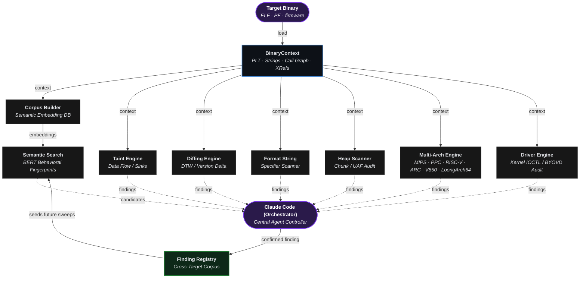
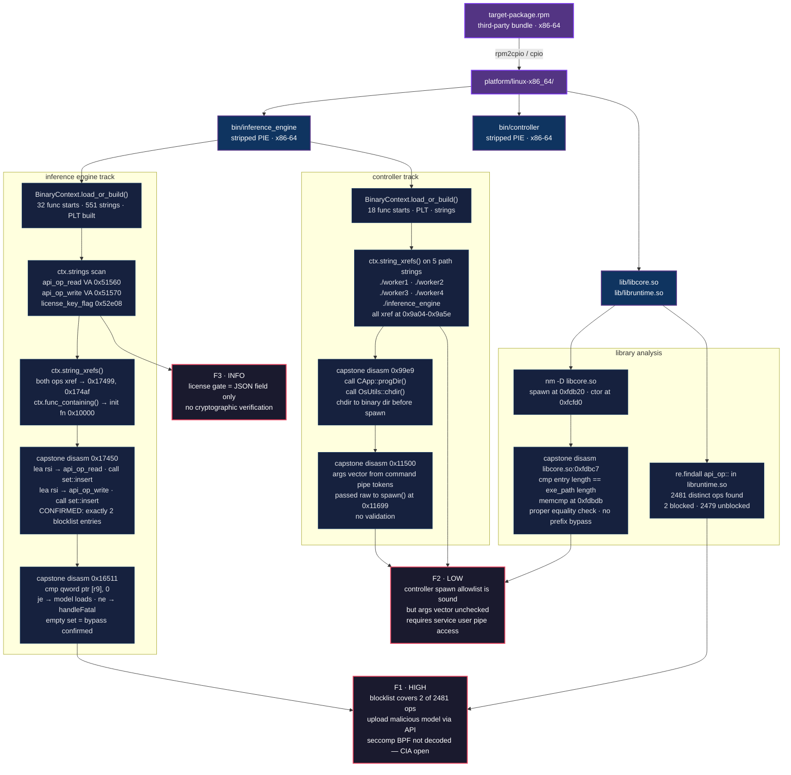

Ablation is a reverse engineering framework that provides the exact same core disassembly, decompilation, and binary analysis capabilities as industry-standard tools like Ghidra, IDA Pro, and Binary Ninja. 

Combined with Claude Code or OpenAI Codex, it transforms into a fully autonomous reverse engineering tool.

---


## Capabilities

**Semantic Search via BERT:** Searches code by concept instead of exact words. By mapping the actual meaning of the text, it cuts through the heaviest bottleneck of reverse engineering to help you pinpoint vulnerabilities faster.

**Extreme Performance:** Loads massive binaries in seconds rather than hours. By only analyzing the code you are actively looking at, it skips the heavy upfront processing of traditional tools so you can start reverse engineering immediately.

**Version Diffing:** Analyzes the actual behavior of updated software to verify vendor patches. It cuts through superficial repackaging to confirm if a vulnerability was genuinely fixed or just hidden.

**FORGE:** Ablation lets users build their own modules and add-ons. FORGE automatically audits that code before it gets stored, so every local module meets the same standard as the ones that ship with Ablation.

**Windows Kernel Driver & BYOVD Analysis:** Scans kernel drivers for risky entry points to stop attackers from using vulnerable, signed drivers to bypass your security software.

**Android / APK Analysis:** Maps out Android app attack surfaces without needing to decompile the code. It automatically scans and ranks internal libraries by security risk, allowing you to immediately target the most vulnerable components.

**Erlang / BEAM Analysis:** Safely scans Erlang bytecode to instantly highlight dangerous functions and hidden attack surfaces without running the application.

**Inter-Binary Taint Analysis:** Tracks the propagation of untrusted, user-controlled data across distinct, compiled executable files or binaries within a system (such as multi-binary firmware or cooperating processes) to detect vulnerabilities where data reaches sinks.

**Cryptographic Analysis**

Ablation strips away every layer that makes cryptography invisible in a compiled binary. Entropy Mapper locates the encrypted region. Crypto Audit and HashAlgoDiscriminator identify the algorithm. XorSolver, BmpKeyExtractor, and CustomCBCDetector break the encryption or recover the key. ELFVtableReconstructor and VtableDispatchScanner reconstruct what the runtime does with the result.

A binary can hide its crypto from import-table analysis, from symbol tables, and from string search. These eight tools collectively close that gap, so by the end you know the algorithm, the key, and the ciphertext.

---

## Decompilers

| ISA / Runtime | Variants |
|---|---|
| x86 | x86-32 · x86-64 |
| ARM | ARM-32 · ARM-64 |
| MIPS | MIPS-32 · nanoMIPS · MIPS-64 |
| PowerPC | PPC-32 · PPC-64 |
| RISC-V | RISC-V 32 · RISC-V 64 |
| ARC | ARC EM/HS |
| V850 | V850-32 |
| LoongArch | LoongArch64 |
| DEX | Dalvik · ART |
| ARK | ArkTS |
| BEAM | Erlang · Elixir |

---
## Real-World Results
Ablation has been used to analyze production firmware and kernel drivers from Fortinet, Cisco, Juniper, IBM, PlayStation 3, Apple macOS, Microsoft Windows, Axis Communications, HPE, Fujitsu, MikroTik, Orka by MacStadium, Acronis, TencentOS, Huawei, Enigma2, Skydio, Intel, NVIDIA, Dahua Security System, Tuya, and [more](docs/company-index/).

Following coordinated disclosure on Cisco FMC and ISE, the Cisco Product Security Incident Response Team (PSIRT) has adopted Ablation for internal vulnerability triage. Cisco PSIRT is actively using it to triage ongoing disclosure reports across Firepower Threat Defense (FTD), Cisco Secure Client (AnyConnect), HyperFlex, and Catalyst. Cisco Adaptive Security Appliance (ASA) LINA has also been reverse engineered using Ablation, with findings currently under coordinated triage via CERT/CC VINCE.

| CVE | Product | Title | CVSS | Advisory |
|---|---|---|---|---|
| CVE-2026-76420 | Secure Firewall Management Center (FMC) | Peer Impersonation | 9.0 Critical | [cisco-sa-fmc2-multivulns-HXgcqRG](https://sec.cloudapps.cisco.com/security/center/content/CiscoSecurityAdvisory/cisco-sa-fmc2-multivulns-HXgcqRG) |
| CVE-2026-76412 | Secure Firewall Management Center (FMC) | Privilege Escalation to root | 8.5 High | [cisco-sa-fmc2-multivulns-HXgcqRG](https://sec.cloudapps.cisco.com/security/center/content/CiscoSecurityAdvisory/cisco-sa-fmc2-multivulns-HXgcqRG) |
| CVE-2026-76413 | Secure Firewall Management Center (FMC) | Single Sign-On Token Forgery | 8.5 High | [cisco-sa-fmc2-multivulns-HXgcqRG](https://sec.cloudapps.cisco.com/security/center/content/CiscoSecurityAdvisory/cisco-sa-fmc2-multivulns-HXgcqRG) |
| CVE-2026-76447 | Identity Services Engine (ISE) | OCSP Responder Authentication Bypass | 5.3 Medium | [cisco-sa-ise-multiauth-bypass-sgD2HbL4](https://sec.cloudapps.cisco.com/security/center/content/CiscoSecurityAdvisory/cisco-sa-ise-multiauth-bypass-sgD2HbL4) 


---

## Acknowledgments
This project was greatly informed and inspired by several key literary works.

**Research Papers**

| Title | Authors |
|---|---|
| [Reverse Compilation Techniques](https://scholar.google.com/citations?view_op=view_citation&hl=en&user=iseZ69MAAAAJ&citation_for_view=iseZ69MAAAAJ:u-x6o8ySG0sC) · [Specifying the Semantics of Machine Instructions](https://ieeexplore.ieee.org/document/693702) · [UQBT: Adaptable Binary Translation at Low Cost](https://ieeexplore.ieee.org/document/825697) · [Machine-Adaptable Dynamic Binary Translation](https://dl.acm.org/doi/10.1145/351397.351414) | [Dr. Cristina Cifuentes](https://scholar.google.com/citations?hl=en&user=iseZ69MAAAAJ) |
| [Design of a Retargetable Decompiler for a Static Platform-Independent Malware Analysis](https://www.researchgate.net/publication/220849941_Design_of_a_Retargetable_Decompiler_for_a_Static_Platform-Independent_Malware_Analysis) | [Petr Zemek](https://github.com/s3rvac), Lukáš Ďurfina, Jakub Křoustek, Dušan Kolář, Tomas Hruska, Karel Masařík, Alexander Meduna |
| [Finding Taint-Style Vulnerabilities in Linux-based Embedded Firmware with SSE-based Alias Analysis](https://arxiv.org/abs/2109.12209) | Cheng, Zheng, Liu, Guan, Liu, Li, Zhu, Ye, Sun |
| [iResolveX: Multi-Layered Indirect Call Resolution via Static Reasoning and Learning-Augmented Refinement](https://arxiv.org/abs/2601.17888) | Monika Santra, Bokai Zhang, Mark Lim, [Vishnu Asutosh Dasu](https://github.com/vdasu), Dongrui Zeng, [Gang Tan](https://github.com/gangtan) |
| [Extracting Protocol Format as State Machine via Controlled Static Loop Analysis](https://arxiv.org/abs/2305.13483) | [Qingkai Shi](https://github.com/qingkaishi), Xiangzhe Xu, Xiangyu Zhang |
| [NEMETYL: Message Type Identification of Binary Network Protocols using Continuous Segment Similarity](https://arxiv.org/abs/2002.03391) | [Stephan Kleber](https://github.com/vs-uulm), Rens Wouter van der Heijden, [Frank Kargl](https://github.com/fkargl) |
| [Imperfect Forward Secrecy: How Diffie-Hellman Fails in Practice](https://dl.acm.org/doi/10.1145/2810103.2813707) | [David Adrian](https://github.com/dadrian), Karthikeyan Bhargavan, [Zakir Durumeric](https://github.com/zakird), Pierrick Gaudry, Matthew Green, [J. Alex Halderman](https://github.com/jhalderm), [Nadia Heninger](https://github.com/factorable), Drew Springall, Emmanuel Thomé, [Luke Valenta](https://github.com/lukevalenta) |
| [Nonce-Disrespecting Adversaries: Practical Forgery Attacks on GCM in TLS](https://www.usenix.org/conference/woot16/workshop-program/presentation/bock) | [Hanno Böck](https://github.com/hannob), [Aaron Zauner](https://github.com/azet), Sean Devlin, [Juraj Somorovsky](https://github.com/jurajsomorovsky), [Philipp Jovanovic](https://github.com/Daeinar) |
| [Whitening Sentence Representations for Better Semantics and Faster Retrieval](https://arxiv.org/abs/2103.15316) | [Jianlin Su](https://github.com/bojone), [Jiarun Cao](https://github.com/jiaruncao), Weijie Liu, Yangyiwen Ou |
| [Constant Propagation with Conditional Branches](https://dl.acm.org/doi/abs/10.1145/103135.103136) | Mark N. Wegman, F. Kenneth Zadeck |
| [A Simple, Fast Dominance Algorithm](https://www.cs.princeton.edu/techreports/2005/737.pdf) | Cooper, Harvey, Kennedy |
| [libdft: Practical Dynamic Data Flow Tracking for Commodity Systems](https://dl.acm.org/doi/10.1145/2151024.2151042) | [Vasileios P. Kemerlis](https://github.com/vkemerlis), [Georgios Portokalidis](https://github.com/portokalidis), [Kangkook Jee](https://github.com/jikk), Angelos D. Keromytis |

**Books** supplied by [www.oreilly.com](https://www.oreilly.com) | [github.com/oreillymedia](https://github.com/oreillymedia)

| Title | Authors |
|---|---|
| The Art of Software Security Assessment | [Mark Dowd](https://github.com/mdowd79), John McDonald, [Justin Schuh](https://github.com/jschuh) |
| Practical Binary Analysis | [Dennis Andriesse](https://github.com/dennisaa) |
| Practical Malware Analysis | Michael Sikorski, Andrew Honig |
| Practical Reverse Engineering | Bruce Dang, Alexandre Gazet, [Elias Bachaalany](https://github.com/0xeb) |
| Hacking: The Art of Exploitation (2e) | Jon Erickson |
| Learning Linux Binary Analysis | [Ryan O'Neill](https://github.com/elfmaster) |
| Windows Internals Part 1 & 2 | [Pavel Yosifovich](https://github.com/zodiacon), [Mark Russinovich](https://github.com/markrussinovich), David Solomon, [Alex Ionescu](https://github.com/ionescu007), [Andrea Allievi](https://github.com/AaLl86) |
| Rootkits: Subverting the Windows Kernel | Greg Hoglund, Jamie Butler |
| Advanced Compiler Design and Implementation | Steven Muchnick |
| Engineering a Compiler | Keith Cooper, Linda Torczon |
| Practical IoT Hacking | [Fotios Chantzis](https://github.com/ithilgore), Ioannis Stais, Paulino Calderon, Evangelos Deirmentzoglou, Beau Woods |
| Inside the Android OS: Building, Customizing, Managing and Operating Android System Services | [G. Blake Meike](https://github.com/bmeike) |
| Malware Analysis and Detection Engineering | [Abhijit Mohanta](https://github.com/amohanta), Anoop Saldanha |
| Evasive Malware | [Kyle Cucci](https://github.com/d4rksystem) |
| Hacking Cryptography | [Kamran Khan](https://github.com/krkhan), [Bill Cox](https://github.com/waywardgeek) |
| Real-World Cryptography | David Wong |

**Honorable Mention**

[Microsoft Excel (Data Analysis ToolPak)](https://support.microsoft.com/en-us/office/use-the-analysis-toolpak-to-perform-complex-data-analysis-6c67ccf0-f4a9-487c-8dec-bdb5a2cefab6) When analyzing closed infrastructure or securing black-box systems, this exact process is called timing analysis or telemetry reverse engineering. Without source code, the Data Analysis ToolPak mathematically deconstructs how an application works on the backend by strictly observing its inputs and outputs.

---

## Framework Architecture & Module Orchestration



---

## Example RE Workflow

End-to-end analysis of stripped binaries from an RPM bundle. Extraction through BinaryContext, string xrefs, and capstone disassembly to confirmed findings.



## LLM Compatibility

| Provider | Models |
|---|---|
| **Claude Code** | /model claude-sonnet-4-6 |
| **OpenAI Codex** | All models |

---

## Install

```bash
pip install git+https://github.com/Ablation-Tool/ablation
```

---

## Requirements

- Python >= 3.10
- `capstone`, `numpy`, `lief`, `sentence-transformers`, `pyelftools`

---

## Responsible Use

Ablation is built for authorized security research. Use it only against systems you own or have explicit written permission to test. Running it against systems without authorization violates computer fraud laws in most jurisdictions. The authors are not responsible for misuse.
